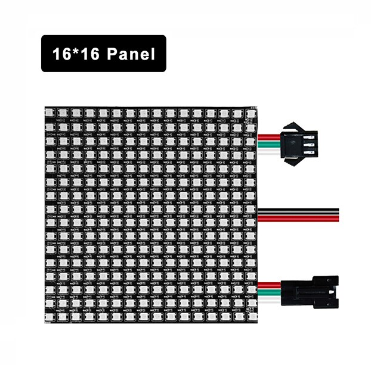
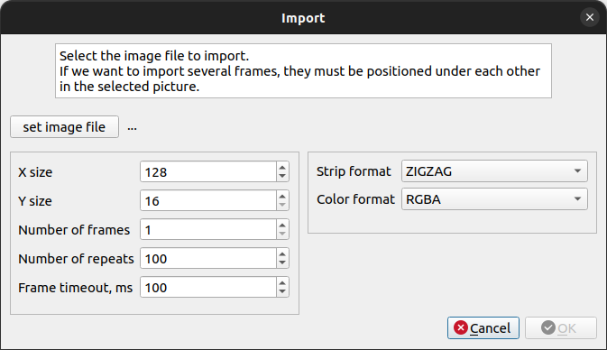

# PXL Viewer

Просмотрщик и конвертор в PXL формат анимированных картинок.

Используемый стек: С++14, STL, Qt5.
Кроссплатформенный код.

PXL - формат оптимизированный для вывода на светодиодные адресные RGB матрицы (например со светодиодами WS2812B). Матрицы могут быть любого размера.



В файл записываются только те пиксклы, которые необходимо отобразить.

Хранятся пикселы в том порядке и формате в котором их необходимо отправлять на ленту. Следовательно, код FirmWare, выводящий изображения, будет тривиальным.

## Фичи

+ Просмотр анимации.
+ Импорт из растровых форматов (png, jpeg, ...).
+ Поддержка прозрачности (в том числе, при импорте из png).
+ Светлый или темный фон.
+ Можно регулировать масштаб отображения.

Для импорта подойдет практически любой растровый формат. 

Размер исходного файла:
+ По ширине - должен быть больше либо равен результирующему PXL файлу.
+ По высоте - должен быть больше либо равен высоте * количество кадров.

Другими словами в исходном файле кадры должны располагаться "в столбик", первый кадр сверху.

При импорте задаются настройки ленты и анимации.



## Формат файла 

Бинарный файл начинается с заголовка выровненного по одному байту.

```cpp
// Структура описывает заголовок файла.
struct file_header_t
{
    // 3 байта, - Заголовка формата, символы таблицы ASCII. Например: 'PIX'.
    char type[3];

    // 1 байт, - версия формата файла.
    uint8_t version;

    // 1 байт, - Полный размер изображения в пикселях по оси X.
    uint8_t size_x;

    // 1 байт, - Полный размер изображения в пикселях по оси Y.
    uint8_t size_y;

    // 1 байт, - Формат данных: Порядок цветов и способ подключения ленты.
    file_format_t format;

    // 2 байта, - Число кадров анимации, от 1 до 65535. ( по сути кол-во структур file_frame_t )
    uint16_t img_frames;

    // 1 байт, - Кол-во повторов анимации, от 0 до 255. 0 - статичная картинка, 255 - бесконечно.
    uint8_t img_repeats;

};
```

Структура `file_format_t` описывает формат светодиодной панели


```cpp
struct file_format_t
{
    // Младшие 4 бита, - Формат порядка и типа ленты.
    format_strip_t strip:4;

    // Старшие 4 бита, - Формат порядка и типа цветов.
    format_color_t color:4;
};

// Типы и порядок ленты.
enum format_strip_t : uint8_t
{
    STRIP_LINE = 0x00,
    STRIP_X01 = 0x01,
    STRIP_ZIGZAG = 0x02
};

// Типы и порядок цветов.
enum format_color_t : uint8_t
{
    COLOR_RGB  = 0x00,
    COLOR_RGBA = 0x01,
    COLOR_GRBA = 0x02
};

```

Далее идут кадры, описанные структурой `file_frame_t`.


```cpp

// Структура заголовка кадра.
struct file_frame_t
{
    // 2 байта, - Время, в мс, отображения текущего кадра, от 0 до 65535.
    uint16_t frame_timeout;

    // 2 байта, - Число пикселей в текущем кадре. ( по сути кол-во структур file_pixel_t )
    uint16_t frame_pixels;

    // Далее идут пиксели, описанные структурой file_pixel_t.
};

// Структура данных каждого пикселя.
struct file_pixel_t
{
    // Кол-во пропущенных пикселей относительно предыдущего.
    // При итерации по пикселям проверять смещение чтобы < (size_x * size_y).
    uint16_t skip;

    // 4 х 1 байт, - Компоненты цвета согласно переданному формату.
    uint8_t color1;
    uint8_t color2;
    uint8_t color3;
    uint8_t color4;
};

```

## Created by
Mihrom / development

Dragon_Knight / file format